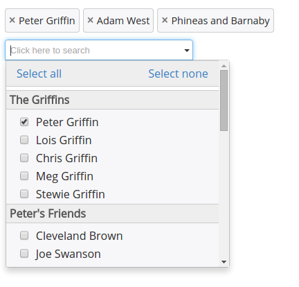

Searchable Option List
======================

Searchable Option List (SOL) is a [jQuery](http://www.jquery.com) plugin which enhances your `<select>` HTML elements and makes the options searchable. It works for regular option lists as well as those marked as `multiple`.

## Documentation

The documentation is available on the [github project page](http://pbauerochse.github.io/searchable-option-list/)
