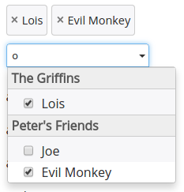

Searchable Option List
======================

Searchable Option List (SOL) is a jQuery plugin which replaces your regular HTML `<select>` elements with a searchable, user friendly component.

## What are the benefits of using SOL?

- fully searchable options
- various types of loading the data
- easy to use multi select (no <kbd>Ctrl</kbd> press needed)
- fully CSS stylable

